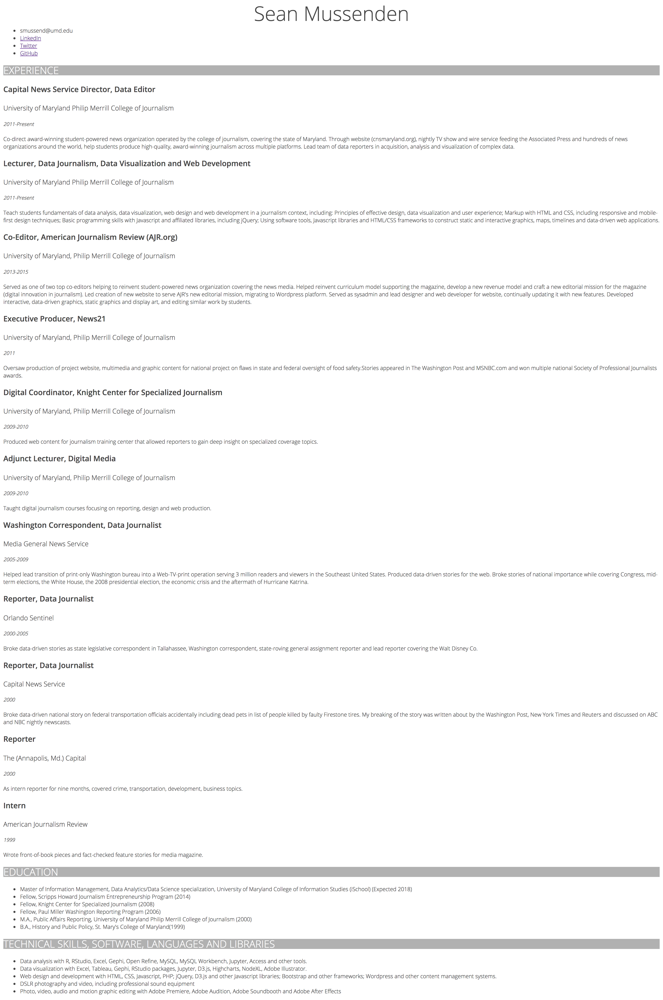

# In-class assignment 1.3

**How to submit:** Commit index.html to GitHub Pages site. Put link to GitHub pages site in ELMS.

## Getting started

* A. Open GitHub Desktop, and, if you're on a new computer, clone GitHub pages repo to your desktop. If you're on the same computer, sync.
* B. Open index.html in your repo in Atom on one side of the screen.
* C. Open index.html in Google Chrome on the other side of the screen.
* D. When you make changes in index.html in Atom, refresh index.html in Chrome to see changes. This is critical.  **Get into the habit of making a single change, and refreshing in the browser to check it.**
* E. Periodically commit changes on GitHub Desktop and sync to master.  

## Detailed instructions

When you're finished with this assignment, your resume should look essentially identical to the image at the bottom of this page.  Pay close attention to the following guidelines:  

* Create a blank file called "style.css" and save it in your repo. This is your stylesheet.
* Connect the stylesheet to your html document, using the appropriate code.
* Style the resume as follows:
  * the default font for the body should be Open Sans, which is a Google Font, 12 pixels, in a dark gray (`#444444`). The fallback font should be Arial, and after that, a generic sans-serif.  Unless otherwise specified, the level of boldness for all elements is 300 (hint: the boldness may not work correctly if you try to apply it to the body tag).   
  * **NAME:** Your name should be 48 pixels, the largest element on the page, but I don't want you to write the value in pixels.  Write it in em. You should also center your name on the page. The height of the line for your name should be set to 0.
  * **SECTION TITLES:** The section titles should be twice the size of the page default.  The height of the line for the section title should be set to the same size as the page default font-size. It should be in all capital letters, but **DO NOT MODIFY the text on the html page** to do this, use a css property. There should be a gray box behind the section titles using this hex code `#b1b1b1`).  The text color should be white.  Please use RGBA to do this, not a hex code or the word "white".
  * **Job Titles**: Should have a boldness level of 600.  The font should be 50 percent larger than the page default. Set a line-height equal to the font-size you use.
  * **Job Organization**: Set to 33 percent larger than the default font-size.
  * **Job Dates**: Italicize, and set equal to default font-size.
  * **Contact Info, Skills, Education**: The items in these lists should be 10 percent larger than the default font-size.  
* In your HTML document and stylesheet, use proper indentation and spacing.
* At the top of your stylesheet, put a comment that says "styles for my resume" and, before each selector, put a short comment describing what's below.  For example, above the h1 tag, you might put "banner name at top".
* As you build this page, make at least 3 commits and syncs to your repo on GitHub.

## Example resume

