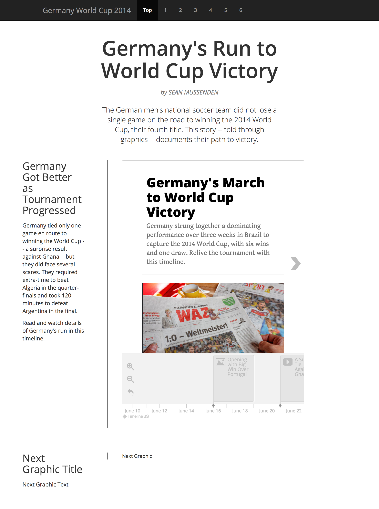
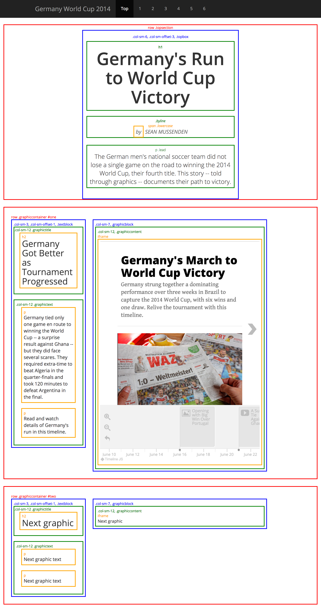

# In-class assignment 2.5

**How to submit:** Commit index.html to GitHub Pages site. Put link to GitHub pages site in ELMS.

## Interactive timelines

For the next week and a half, we'll be using digital story telling tools and code to tell visual stories (a timeline, maps and charts) about Germany's run to the World Cup title in 2014.  We'll start, today, with an interactive timeline, built using a tool called Timeline.js, one of the many free, open-source storytelling tools used by news organizations.   

## Instructions

Your assignment today is to build the interactive timeline of Germany's game recap that appears on the page ["Germany's Run to the World Cup."](http://smussenden.github.io/germany-world-cup/index.html)

You will use [Timeline.JS](https://timeline.knightlab.com/), an intuitive, free tool for building timelines to embed on a web page.  You will store the information for the timeline in a Google Spreadsheet.  Just like yesterday, you will learn how to use this on your OWN, with limited guidance from me. I encourage you to read the documentation.  

## Important Information for This Assignment

You will work with a partner to create this timeline, working on ONE computer, taking turns at the keyboard.  You will ultimately produce only one version of this timeline that both of you will use to embed onto your page.

All of the information that you will need to build this exact timeline (dates, headlines, descriptions, path to images, youtube links, image credits, etc...) are contained [in this spreadsheet](germany-timelinejs-info.xlsx).  Please use the text, links and files provided. Note:

* There is one title slide, which should have a headline, an introductory paragraph, an image and a caption.
* There is one slide for each game Germany played during the World Cup, featuring the date, a headline, a short paragraph, a link to a game recap, an image (or a YouTube video), and an image/video credit.  

## Creating a page to host Germany World Cup Stories

When you are finished building the timeline, and you are confident that it looks IDENTICAL to mine, you will then build a page, starting from a fresh Bootstrap template, that look like the page below.

## Getting Started

In your GitHub repo, make a copy of the folder "bootstrap-starter-example" and rename it "germany-world-cup".  Open index.html and customstyles.css in Atom. From index.html, delete this bit of code:
```html
<div class="container"> <!--beginning of main body section of document -->
  All content goes here
</div><!-- /.container -->
```

## HTML structure

Set up the structure of the page by nesting div, p, h1, h2, span with the following classes and IDs according to the structure in the image of the page with the colored boxes.  Use the class names used in that document. Unless otherwise specified, each colored box is a div.

* **the nav bar at the top** On the left, it should say Germany World Cup 2014 followed by the numbers 1 through 6, with an href of #one, #two, et cetera.
* **body** Set 50 pixels of padding on the top.  Set the font to Open Sans, which is a Google Font (please import ALL styles of this font), and set the fallback to Helvetica, then sans-serif.  Set the root font size of the document to 12px.
* **.topsection** Center the text (not the div, the text in the div). Set the top margin to 20px and 0px on all other sides.
* **.topbox** Don't apply any styles.
* **h1 inside of topbox** Set the font size to 5 rem (not em, rem; ask me about this if you're confused). Set the boldness level to 600.
* **.byline** Set the font size to 1.5 rem.  Using CSS, make the text all caps. Set the boldness level to 400.  Set the text color to #777.  Set 15 pixels on the top of margin, 0 pixels on the left and right, and 20 pixels on the bottom. Make the text italic.
* **span .lowercase** Make the text inside span tag inside of byline lowercase.
* **p .lead** Set the font size to 1.75 rem.
* **.graphiccontainer** Set the margin on the bottom at 20px, 0 on all other sides.  Set the padding 20px all the way around.
* **.textblock** Set the margin on the right at 20px, 0 on all other sides.  Set the padding on the right and left at 20px, 0 on all other sides.
* **.graphictitle** Don't apply any styles.
* **h2 inside .graphictitle** Set the font size at 2.5 rem.  Set margin and padding to 0.
* **.graphictext** Set the margin on the top at 15 pixels, 0 on all other sides.
* **paragraph inside .graphictext** Set the font size at 1.35 rem.
* **.graphicblock** Set the padding at 20px on left and right, 0 on top and bottom. Set a left border of 2 pixels that is solid, with a color of #777;
* **.graphiccontent** Don't apply any styles.

You'll need only one media query section in this document, to apply only to the extra small bootstrap column width:

* **.textblock** Set the margin all the way around to 0px.  Set the padding all the way around to 20px.
* **.graphicblock** Set the border on all sides but the bottom to 0.  The bottom should still have the same border style, but on the bottom now, instead of the left. Set the padding all the way around to 20px.
* **.topsection** Set the padding all the way around to 20px.
* **h1 in topsection** Set the font size to 3.8 rem.


## Submission

When you're finished, commit the changes to GitHub and submit the link to your germany-world-cup folder site on ELMS (yourname.github.io/germany-world-cup)

# Page image



# HTML structure

